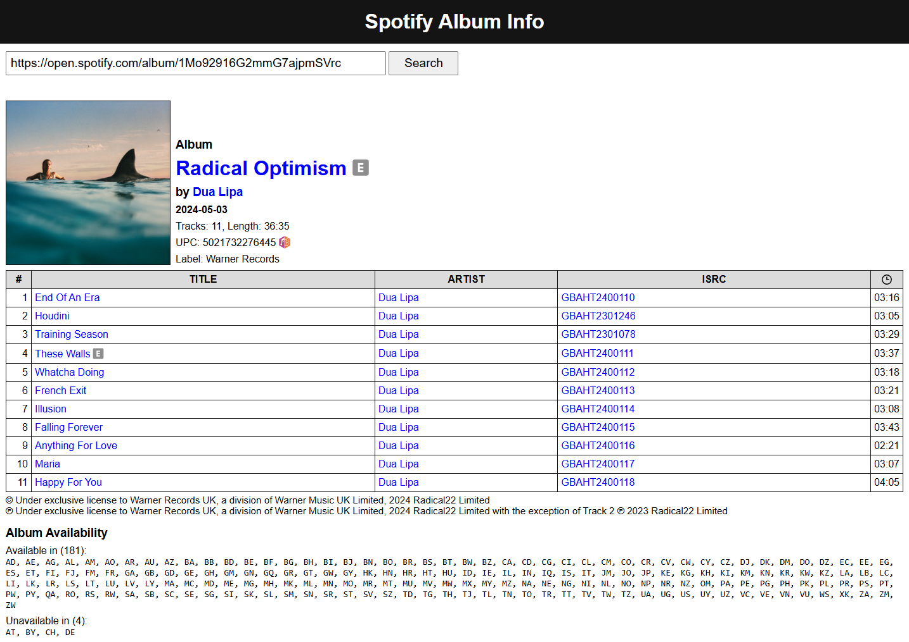

# Spotify Album Info

A simple web application to fetch album metadata from [Spotify](https://open.spotify.com/). This project is written in pure JavaScript with a minimalistic UI design.

## How to Use

1. Open the app: [Spotify Album Info](https://pawllo01.github.io/spotify-album-info/)
2. Paste a valid Spotify album URL (e.g., `https://open.spotify.com/album/1Mo92916G2mmG7ajpmSVrc`) or just the album ID (`1Mo92916G2mmG7ajpmSVrc`) into the input field.
3. Click the **Search** button.

Sometimes, the app may experience temporary issues. If it doesn't work, please wait a few minutes and try again.

## Features

Spotify Album Info provides additional metadata, including:

- **UPC** (Universal Product Code) of the album
- **Label** that released the album
- **ISRCs** (International Standard Recording Codes) for tracks
- **Availability** of the album across regions

### Interactive Elements

- **Clickable blue elements (links)**: Redirect to the corresponding resources on Spotify.
- **Album cover**: Click to view and download a high-resolution album cover (up to 2000px).
- **MusicBrainz lookup**: Click the icon next to the UPC to quickly search for the album on [MusicBrainz](https://musicbrainz.org/).
